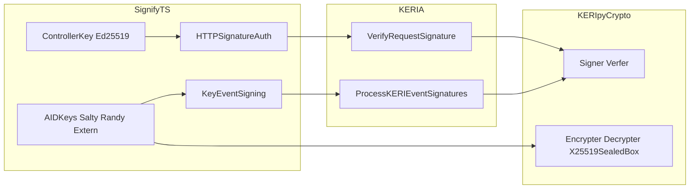

+++
draft = true
title = "Libsodium, Ed25519, and secp256k1 in KERI: What Is Possible vs What Is Implemented"
slug = "libsodium-ed25519-secp256k1-keri"
date = "2026-01-29"

[taxonomies]
tags = ["keri", "keripy", "keria", "signify-ts", "libsodium", "ed25519", "secp256k1", "cryptography"]

[extra]
comment = true
+++

If you are evaluating secp256k1 in the KERI stack today, you need two separate answers:

1. **What the cryptography allows in principle**
2. **What KERIpy + KERIA + SignifyTS currently implement in practice**

This post is a method-by-method breakdown of those requirements, followed by the strongest argument **for** and **against** secp256k1 adoption right now.

The short version is:

- secp256k1 is already present in core KERIpy signing and verification paths.
- the stack is still Ed25519/X25519-centric in key-management and HTTP auth paths.
- the key blocker is not "proprietary secp256k1 encryption libraries." It is architecture and interoperability debt.

## Challenge the assumptions first

Before arguing policy, challenge the claims.

### Claim A: "Sealed box crypto is only available with Ed25519."

This is **not** correct.

In libsodium, sealed box is `crypto_box_seal`, which is built on **X25519** key exchange plus XSalsa20-Poly1305. Ed25519 is a signature scheme, not the sealed-box encryption primitive.

Why the confusion happens in KERI code:

- KERIpy/SignifyTS derive X25519 encryption keys by converting Ed25519 keys (`crypto_sign_*_to_curve25519`).
- So the implementation looks Ed25519-bound, even though sealed box itself is X25519-based.

### Claim B: "You need proprietary software to do secp256k1 encryption."

Also **not** correct as stated.

There are open-source secp256k1 ECIES/KEM implementations across Python/TypeScript/Rust/Go ecosystems. The problem is not availability. The problem is that these schemes are not drop-in replacements for the existing KERI stack conventions (cipher formats, key lifecycle, migration, interop guarantees, and security review expectations).

### Claim C: "If secp256k1 signing exists, secp256k1 is fully supported."

No.

Signing support is necessary but not sufficient. You also need:

- storage encryption/decryption compatibility,
- controller request authentication compatibility,
- algorithm negotiation and migration strategy across Signify clients and KERIA.

## Fact-check matrix

The matrix below is the evidence baseline used for this article revision.

| Claim | Verdict | Why | Anchor(s) |
|---|---|---|---|
| "secp256k1 is NIST/FIPS approved" | **False in general federal-compliance context** | FIPS 186-5 points to NIST-recommended curves in SP 800-186; secp256k1 is not in that recommended set. | FIPS 186-5, SP 800-186 |
| "secp256k1 is unusable in serious systems" | **Misleading without context** | High-assurance implementations exist (e.g., hardened constant-time `libsecp256k1`); usability depends on implementation discipline and protocol design. | `libsecp256k1` README |
| "ECDSA nonce reuse is catastrophic" | **True** | ECDSA security depends on per-signature nonce quality; nonce failures can recover private keys. Deterministic nonce generation is a standard mitigation. | RFC 6979 |
| "signature malleability is a secp256k1-only problem" | **False** | This is an ECDSA property, not unique to secp256k1. Ecosystems mitigate with canonicalization and/or alternate signature schemes. | BIP 62, BIP 340 motivation |
| "key substitution/impersonation is purely a curve flaw" | **Partially true but mostly protocol-level** | Related-key and key-binding failures are largely protocol construction issues; curve choice can influence risk surface but does not alone determine safety. | BIP 340 key-prefixing rationale, protocol literature |
| "related-key/derivation attacks are inevitable with secp256k1" | **Misleading without context** | Naive derivation can be dangerous; hardened derivation/key-prefixing and careful design mitigate this class. | BIP 340, BIP 32 context |
| "side-channel leakage is unavoidable on secp256k1" | **False** | Leakage is implementation-dependent. Constant-time implementations, blinding, and hardened libraries materially reduce practical risk. | `libsecp256k1` README |
| "you need proprietary code for secp256k1 encryption" | **False** | Open-source secp256k1 ECIES/KEM implementations exist. The real issue is integration and interoperability with existing stack assumptions. | ECIES OSS projects + current stack code trace |

## Security concerns often raised about secp256k1 (and what they really mean)

This section captures common concerns and separates **curve math**, **signature scheme behavior**, and **implementation/protocol engineering**.

- **NIST/FIPS status (compliance concern)**  
  In many federal or FIPS-bound environments, secp256k1 is not the default compliance path. That is a policy/compliance issue, not a proof that secp256k1 cannot be secure in non-FIPS deployments.

- **Signature malleability (ECDSA concern)**  
  ECDSA signatures are malleable unless canonicalization rules are enforced. This is one reason ecosystems use low-S rules and strict encodings, or move to Schnorr variants that are designed to be non-malleable.

- **Nonce reuse or weak nonce generation (implementation concern, high severity)**  
  Poor nonce generation in ECDSA is catastrophic. Deterministic nonce generation (RFC 6979) and robust implementation controls are standard mitigations.

- **Key substitution / related-key confusion (protocol concern)**  
  This is often a key-binding problem, not a curve-only problem. Modern constructions add explicit key-prefixing and domain separation to prevent cross-context misuse.

- **Related-key / HD derivation pitfalls (design concern)**  
  Naive additive derivation can create cross-key risk. This is mitigated through hardened derivation policies and scheme-level protections.

- **Side-channel leakage (implementation concern)**  
  Security depends heavily on constant-time behavior, memory-access discipline, and blinding. Mature libraries can significantly reduce this risk, but only when integrated correctly.

### Supportive vs contradictory viewpoints

For balance:

- **Supportive of caution:** SafeCurves and many engineering postmortems emphasize how easy it is to fail ECC securely in real systems.
- **Contradictory to blanket rejection:** modern hardened secp256k1 libraries and Schnorr-based standards demonstrate that many historical concerns can be reduced with contemporary implementations and protocol design.

The practical takeaway is not "always use secp256k1" or "never use secp256k1." The practical takeaway is that the security burden shifts from curve selection alone to full-stack engineering quality.

## Method-by-method requirements inventory

This section is the real requirement baseline for introducing any new cryptographic suite.

## 1) Signing and verification requirements

### KERIpy

- `keri/core/signing.py`:
  - `Signer.__init__(..., code=MtrDex.Ed25519_Seed, ...)` supports multiple seed codes.
  - `Signer._ed25519(...)` exists.
  - `Signer._secp256k1(...)` exists.
- `keri/core/coring.py`:
  - `Verfer` supports Ed25519 and secp256k1 verification paths.

**Implication:** core KEL event signing/verification in KERIpy already has secp256k1 capability.

### SignifyTS

- `src/keri/core/signer.ts`:
  - currently Ed25519-only signer implementation.
- `src/keri/core/verfer.ts`:
  - `VERFER_CODES` excludes secp256k1; unsupported code error is thrown.

**Implication:** even if KERIpy can verify secp256k1, SignifyTS cannot natively produce/verify secp256k1 signatures today without substantial changes or extern offload patterns.

## 2) Key derivation and stretching requirements

### KERIpy

- `keri/core/signing.py`:
  - `Salter.stretch(...)` uses `crypto_pwhash` (Argon2id).
  - `Salter.signer(..., code=...)` can produce signers for different suites.

Argon2id stretching is not curve-locked by itself. The coupling appears later in encryption/decryption and surrounding management paths.

## 3) Secrets-at-rest encryption/decryption requirements (critical blocker path)

This is where the stack becomes Ed25519/X25519-coupled.

### KERIpy

- `keri/core/signing.py`:
  - `Encrypter.__init__(..., verkey=...)` accepts only Ed25519 verkeys for conversion to X25519 (`crypto_sign_pk_to_box_pk`).
  - `Encrypter._x25519(...)` uses `crypto_box_seal`.
  - `Decrypter.__init__(..., seed=...)` accepts only Ed25519 seed for conversion to X25519 private key (`crypto_sign_sk_to_box_sk`).
  - `Decrypter._x25519(...)` uses `crypto_box_seal_open`.

**Hard requirement today:** the key-protection path assumes Ed25519 material that can be converted into X25519 keys for sealed-box operations.

### SignifyTS

- `src/keri/core/encrypter.ts`:
  - converts Ed25519 public key to X25519 (`crypto_sign_ed25519_pk_to_curve25519`).
- `src/keri/core/decrypter.ts`:
  - converts Ed25519 secret key to X25519 (`crypto_sign_ed25519_sk_to_curve25519`).

**Hard requirement today:** same pattern as KERIpy.

## 4) HTTP request authentication requirements (SignifyTS <-> KERIA)

This is distinct from AID key-event signatures.

### SignifyTS request signing

- `src/keri/core/authing.ts`:
  - `Authenticater.sign(...)` sets `alg: 'ed25519'`.

### KERIA request/response auth

- `src/keria/core/authing.py`:
  - `Authenticater.sign(...)` passes `alg='ed25519'`.
  - `Authenticater.verify(...)` validates using controller kever verifier.

**Implication:** controller-channel HTTP auth is Ed25519-assumed in both client and server codepaths.

## 5) Extern/HSM boundaries

Extern modules are helpful but not magic.

- Extern/HSM paths can own AID event signing.
- They do **not** automatically replace controller HTTP auth semantics.
- They do **not** automatically solve encrypted secret storage assumptions in local/agent-managed paths.

That is why "extern support exists" and "full secp256k1 stack support exists" are not equivalent statements.

## Architecture map: where the coupling lives

## The strongest argument FOR secp256k1 usability now

If your requirement is "secp256k1 for AID event signatures," the case is strong:

1. KERIpy already implements secp256k1 signing/verification primitives.
2. Extern/HSM approaches can centralize secp256k1 control for key events.
3. You can run a **hybrid model**:
   - keep controller/auth and secret-wrapping on Ed25519/X25519,
   - use secp256k1 for AID event-level signatures where policy requires it.

That hybrid is practical and avoids rewriting the most brittle cross-language crypto plumbing in one step.

## The strongest argument AGAINST secp256k1 usability now

If your requirement is "make secp256k1 first-class everywhere in the stack," the case is weak today:

1. Current controller HTTP auth paths assume Ed25519 algorithm tags and behavior.
2. Current encrypted-key-storage paths are tightly coupled to Ed25519->X25519 conversion in both KERIpy and SignifyTS.
3. A full migration would require protocol and implementation decisions, not just adding curve math:
   - cipher and key-wrap formats,
   - migration from existing encrypted state,
   - interoperability profile and conformance tests,
   - security review and operational hardening.

In other words: "new signer exists" is easy; "safe, interoperable, production-grade suite migration" is hard.

## What must be reimplemented for a full new crypto suite

Treat this as the concrete engineering checklist.

## A) KERIpy

1. **Encryption abstraction decoupling**
   - remove Ed25519-only assumptions from `Encrypter`/`Decrypter` init paths.
2. **New key-wrap profile**
   - define and implement equivalent-at-rest encryption semantics for non-Ed25519 signing identities.
3. **Suite negotiation metadata**
   - ensure stored metadata and APIs can express auth-signing suite and key-wrap suite independently.

## B) KERIA

1. **HTTP auth algorithm flexibility**
   - replace hardcoded `alg='ed25519'` assumptions with suite-aware behavior.
2. **Controller lifecycle updates**
   - verify controller create/rotate/auth path with non-Ed25519-compatible policies where required.
3. **Compatibility handling**
   - explicit negotiation or profile enforcement between old and new clients.

## C) SignifyTS

1. **Signer/verifier expansion**
   - implement secp256k1 signer and verifier paths (today verifier list excludes secp256k1).
2. **Authing updates**
   - replace fixed `alg: 'ed25519'` with suite-aware behavior.
3. **Key protection subsystem changes**
   - redesign `encrypter.ts` and `decrypter.ts` assumptions if moving away from Ed25519->X25519 conversion.

## D) Cross-stack test matrix

Minimum matrix should include:

- KERIpy <-> KERIA <-> SignifyTS interop for:
  - inception, rotation, interaction,
  - request authentication,
  - backup/recovery and encrypted secret migration,
  - mixed-suite deployments and rollback behavior.

Without this matrix, claims of "support" are only partial.

## Recommendation: choose your target honestly

You likely have two realistic strategies:

1. **Near-term strategy (recommended for delivery): hybrid adoption**
   - secp256k1 where policy needs it (AID event signatures),
   - keep Ed25519/X25519 for controller auth and key protection.
2. **Long-term strategy: full-suite redesign**
   - only if you are ready to fund cross-language crypto profile work, migration design, and heavy test/security effort.

The right decision depends on whether your actual requirement is:

- cryptographic purity ("one suite everywhere"), or
- interoperable production capability under current ecosystem constraints.

## Decision test

Before selecting secp256k1 policy in this stack, answer these four questions:

1. **Compliance constraint:** Do you need strict FIPS/NIST alignment for deployment?
2. **Interoperability constraint:** Must you interoperate with existing Ed25519/X25519 stack assumptions now?
3. **Operational constraint:** Do you have a mature HSM/external signer path for secp256k1 event signing?
4. **Engineering budget:** Can you fund migration, hardening, and cross-stack conformance testing?

If (1) is strict, secp256k1 may be a poor immediate fit.  
If (2) and (4) dominate, hybrid adoption is usually the safer delivery path.

## Final conclusion

secp256k1 is **usable** in parts of KERI today, but not **fully integrated end-to-end** in the default KERIpy/KERIA/SignifyTS stack.

That distinction matters. Most architecture arguments become clearer once you separate:

- **cryptographic possibility** from
- **current implementation reality**.

## References

- Libsodium sealed boxes (`crypto_box_seal`):  
  <https://doc.libsodium.org/public-key_cryptography/sealed_boxes>
- Libsodium Ed25519->Curve25519 conversion APIs:  
  <https://libsodium.gitbook.io/doc/advanced/ed25519-curve25519>
- NIST FIPS 186-5 (Digital Signature Standard):  
  <https://doi.org/10.6028/NIST.FIPS.186-5>
- NIST SP 800-186 (recommended elliptic-curve domain parameters):  
  <https://doi.org/10.6028/NIST.SP.800-186>
- RFC 6979 (deterministic nonce generation for ECDSA/DSA):  
  <https://www.rfc-editor.org/rfc/rfc6979>
- BIP 62 (ECDSA malleability handling context):  
  <https://bips.dev/62>
- BIP 340 (Schnorr over secp256k1; non-malleability motivation and related-key protections):  
  <https://bips.dev/340>
- `libsecp256k1` high-assurance implementation notes (constant-time and hardening features):  
  <https://github.com/bitcoin-core/secp256k1>
- SafeCurves criteria and secp256k1 assessment context:  
  <https://safecurves.cr.yp.to/>
- Example OSS secp256k1 ECIES implementation set:  
  <https://github.com/ecies/py>
- KERIpy core signing/encryption code:  
  <https://github.com/WebOfTrust/keripy/blob/main/src/keri/core/signing.py>
- KERIpy verifier code:  
  <https://github.com/WebOfTrust/keripy/blob/main/src/keri/core/coring.py>
- KERIA request auth code:  
  <https://github.com/WebOfTrust/keria/blob/main/src/keria/core/authing.py>
- SignifyTS signer/verifier/auth/encryption code:  
  <https://github.com/WebOfTrust/signify-ts/tree/main/src/keri/core>
