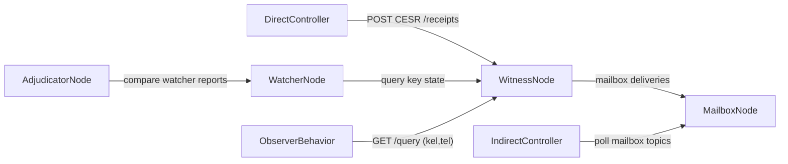

+++
draft = true
title = "KERI Node Types in Practice: Controller, Mailbox, Witness, Watcher, Observer, Adjudicator"
slug = "keri-node-types-in-practice"
date = "2026-02-17"

[taxonomies]
tags = ["keri", "keripy", "kli", "witness", "watcher", "mailbox", "adjudicator", "observer", "configuration"]

[extra]
comment = true
+++

When people ask about "KERI nodes," they usually mean one of seven operational roles:

1. controller (direct mode agent)
2. mailbox (for indirect mode)
3. controller (indirect mode via mailbox)
4. witness
5. watcher
6. observer
7. adjudicator

This guide is intentionally compact and operational: what each role is, where it lives in code, how to configure it, how to run it, and how to validate it.

## One-screen mental model



## Code-traced definitions

### 1) Controller (direct mode agent)

**Definition**: A controller that sends events/queries directly to peers and witnesses and processes receipts in-band.

**Code anchors**:
- `keri/app/directing.py` (`Director`, `Directant`, `Reactor`)
- `keri/app/indirecting.py` (`Indirector(..., direct=True)` paths)

**Why it matters**: Lowest-latency operational mode. Fewer moving parts than mailbox polling.

### 2) Mailbox

**Definition**: Message storage and streaming endpoint used to deliver out-of-band replies, receipts, and replay material in indirect mode.

**Code anchors**:
- `keri/app/storing.py` (`Mailboxer`)
- `keri/app/indirecting.py` (`MailboxDirector`, `Poller`, mailbox SSE stream behavior)
- `keri/app/cli/commands/mailbox/add.py`

**Why it matters**: Enables asynchronous delivery, especially when controllers are not always online.

### 3) Controller (indirect mode, using mailbox)

**Definition**: A controller that does not depend on direct transport for every interaction; it polls mailbox endpoints and witnesses for queued messages.

**Code anchors**:
- `keri/app/indirecting.py` (`MailboxDirector`, `Poller.eventDo`, topic tracking)

**Why it matters**: Production-friendly for intermittent connectivity and delegated workflows.

### 4) Witness

**Definition**: A non-transferable receiptor node that validates events, receipts them, and answers query endpoints for KEL/TEL retrieval.

**Code anchors**:
- `keri/app/indirecting.py` (`setupWitness`, `ReceiptEnd`, `QueryEnd`, `HttpEnd`)
- `keri/app/cli/commands/witness/start.py`
- `keri/app/cli/commands/witness/demo.py`

**Why it matters**: Witnesses are core verifiability and availability infrastructure.

### 5) Watcher

**Definition**: A monitoring role that tracks watched identifiers and collects reported key state for later consistency checks.

**Code anchors**:
- `keri/app/cli/commands/watcher/add.py`
- `keri/app/cli/commands/watcher/list.py`
- watcher state records in database structures (`obvs`, `knas`, `ksns`)

**Why it matters**: Gives independent state visibility beyond the local controller's view.

### 6) Observer

**Definition (practical)**: A read-only behavior that queries witness state and logs (not a separate standalone CLI role in current KLI).

**Code anchors**:
- witness query endpoints in `keri/app/indirecting.py` (`QueryEnd.on_get`)
- query routes: `typ=kel`, `typ=tel`

**Why it matters**: Operationally useful for audit/read-only systems and troubleshooting.

### 7) Adjudicator

**Definition**: A consistency engine that compares watcher-reported key states and emits outcomes like consistent, lagging, update, or duplicitous.

**Code anchors**:
- `keri/app/watching.py` (`Adjudicator`, `DiffState`, adjudication cues)
- `keri/app/cli/commands/watcher/adjudicate.py`

**Why it matters**: Converts watcher data into actionable integrity decisions.

## Shared primitives: endpoint roles and location schemes

Most node interop depends on two record classes:

1. **Endpoint role authorization** (`/end/role/add`) via `kli ends add`
2. **Location scheme record** (`/loc/scheme`) via `kli location add`

`Roles` currently include values like `controller`, `witness`, `watcher`, `mailbox`, `agent`, `judge`, `juror` in `keri/kering.py`.

### Canonical commands

```bash
# endpoint role authorization
kli ends add \
  --name <keystore_name> \
  --alias <local_alias> \
  --role <controller|witness|mailbox|watcher|agent|judge|juror> \
  --eid <endpoint_aid>

# location scheme record (scheme inferred from URL)
kli location add \
  --name <keystore_name> \
  --alias <local_alias> \
  --eid <endpoint_aid> \
  --url http://127.0.0.1:56xx/
```

Note: legacy examples often show `kli loc add`. In current source, the command implementation is under `commands/location/add.py`, and the canonical form shown here is `kli location add`.

## Minimal configs by component type

### Controller (direct mode)

Use a controller config with witness OOBIs in `iurls` and optional service URLs in controller section `curls`.

```json
{
  "dt": "2026-02-17T00:00:00.000000+00:00",
  "alice": {
    "dt": "2026-02-17T00:00:00.000000+00:00",
    "curls": ["http://127.0.0.1:7723/"]
  },
  "iurls": [
    "http://127.0.0.1:5642/oobi/<WIT_AID>/controller"
  ]
}
```

### Mailbox

Register mailbox role so other participants can deliver mailbox-bound messages:

```bash
kli mailbox add --name <ctrl_name> --alias <ctrl_alias> --mailbox <mailbox_alias_or_aid>
kli mailbox list --name <ctrl_name> --alias <ctrl_alias>
```

### Witness

Witness runs HTTP and TCP listeners:

```bash
kli witness start --name wit --alias wit --http 5642 --tcp 5632
```

### Watcher and adjudicator

```bash
kli watcher add --name <ctrl_name> --alias <ctrl_alias> --watcher <watcher_alias_or_aid> --watched <watched_alias_or_aid>
kli watcher list --name <ctrl_name> --alias <ctrl_alias>
kli watcher adjudicate --name <ctrl_name> --alias <ctrl_alias> --watched <watched_alias_or_aid> --toad 1 --poll
```

## Runnable sample script (single-node lab blueprint)

This script is intentionally minimal and uses command patterns already present in:
- `qvi-software/qvi-workflow/kli_only/vlei-workflow.sh`
- `keripy/scripts/demo/basic/delegate.sh`

```bash
#!/usr/bin/env bash
set -euo pipefail

# -------- Inputs --------
WIT_AID="${WIT_AID:-BBilc4-L3tFUnfM_wJr4S4OJanAv_VmF_dJNN6vkf2Ha}"
WIT_OOBI="${WIT_OOBI:-http://127.0.0.1:5642/oobi/${WIT_AID}/controller}"

DIRECT_NAME="direct1"
INDIRECT_NAME="indirect1"
WATCH_CTRL="watchctrl"

echo "1) Start witnesses (in another terminal if not already running)"
echo "   kli witness demo"

echo "2) Initialize three local keystores"
kli init --name "${DIRECT_NAME}" --nopasscode
kli init --name "${INDIRECT_NAME}" --nopasscode
kli init --name "${WATCH_CTRL}" --nopasscode

echo "3) Resolve witness OOBI"
kli oobi resolve --name "${DIRECT_NAME}" --oobi "${WIT_OOBI}"
kli oobi resolve --name "${INDIRECT_NAME}" --oobi "${WIT_OOBI}"
kli oobi resolve --name "${WATCH_CTRL}" --oobi "${WIT_OOBI}"

echo "4) Incept direct and indirect controllers"
kli incept --name "${DIRECT_NAME}" --alias "${DIRECT_NAME}" --wit "${WIT_AID}" --toad 1 --icount 1 --ncount 1 --isith 1 --nsith 1 --transferable
kli incept --name "${INDIRECT_NAME}" --alias "${INDIRECT_NAME}" --wit "${WIT_AID}" --toad 1 --icount 1 --ncount 1 --isith 1 --nsith 1 --transferable

DIRECT_AID="$(kli aid --name "${DIRECT_NAME}" --alias "${DIRECT_NAME}")"
INDIRECT_AID="$(kli aid --name "${INDIRECT_NAME}" --alias "${INDIRECT_NAME}")"

echo "5) Add endpoint role and location records"
kli ends add --name "${DIRECT_NAME}" --alias "${DIRECT_NAME}" --role mailbox --eid "${WIT_AID}"
kli ends add --name "${INDIRECT_NAME}" --alias "${INDIRECT_NAME}" --role mailbox --eid "${WIT_AID}"

kli location add --name "${DIRECT_NAME}" --alias "${DIRECT_NAME}" --eid "${DIRECT_AID}" --url "http://127.0.0.1:7723/"
kli location add --name "${INDIRECT_NAME}" --alias "${INDIRECT_NAME}" --eid "${INDIRECT_AID}" --url "http://127.0.0.1:7724/"

echo "6) Mailbox registration for indirect mode path"
kli mailbox add --name "${INDIRECT_NAME}" --alias "${INDIRECT_NAME}" --mailbox "${WIT_AID}"
kli mailbox list --name "${INDIRECT_NAME}" --alias "${INDIRECT_NAME}"

echo "7) Watcher setup (watch indirect AID)"
# Assumes watcher contact/OOBI material already known to WATCH_CTRL context
# Replace <WATCHER_ALIAS_OR_AID> with your watcher endpoint identity
# kli watcher add --name "${WATCH_CTRL}" --alias "${WATCH_CTRL}" --watcher <WATCHER_ALIAS_OR_AID> --watched "${INDIRECT_AID}"

echo "8) Adjudication (once watcher data exists)"
# kli watcher adjudicate --name "${WATCH_CTRL}" --alias "${WATCH_CTRL}" --watched "${INDIRECT_AID}" --toad 1 --poll

echo "Done. Proceed with validation checks."
```

## Validation and test requests by component

### Controller (direct mode)

```bash
kli status --name direct1 --alias direct1
kli ends list --name direct1 --alias direct1 --aid "$(kli aid --name direct1 --alias direct1)"
```

Expected:
- local AID state is available
- endpoint role records exist for configured roles

### Mailbox

```bash
kli mailbox list --name indirect1 --alias indirect1
```

Expected:
- mailbox endpoint is listed as allowed for the controller context

### Controller (indirect mode using mailbox)

Expected operational signal:
- mailbox polling traffic appears once indirect mailbox routes are configured
- replay/reply topics (`/reply`, `/replay`, `/receipt`) are consumed by pollers

### Witness

```bash
# witness receipts endpoint (event receipt flow)
curl -s "http://127.0.0.1:5642/receipts?pre=<AID>&sn=0"

# observer-style KEL query
curl -s "http://127.0.0.1:5642/query?typ=kel&pre=<AID>"

# observer-style TEL query
curl -s "http://127.0.0.1:5642/query?typ=tel&reg=<REG_AID>"
```

Expected:
- receipt endpoint returns receipt material when event exists
- KEL/TEL queries return CESR JSON payloads for known data

### Watcher

```bash
kli watcher list --name watchctrl --alias watchctrl
```

Expected:
- watcher mappings appear for allowed watcher endpoints

### Observer (witness query behavior)

Use the same `GET /query` endpoints above as read-only checks.

Expected:
- no write-side state changes required
- query visibility depends on witness-held data for the target AID/registry

### Adjudicator

```bash
kli watcher adjudicate --name watchctrl --alias watchctrl --watched <AID> --toad 1 --poll
```

Expected cue classes (from `watching.Adjudicator`):
- `keyStateConsistent`
- `keyStateLagging`
- `keyStateUpdate`
- `keyStateDuplicitous`

Operational interpretation:
- `consistent`: local and watcher states match
- `lagging`: one or more watcher states behind local
- `update`: threshold-satisfying watcher set ahead (candidate update path)
- `duplicitous`: conflicting digests at same sequence (operator intervention)

## Practical gotchas

1. **Role record without location record is incomplete**
   - Add both `kli ends add` and `kli location add` when publishing service endpoints.

2. **Observer is behavior, not a dedicated CLI role**
   - Treat observer as read-only query access over witness APIs.

3. **Versioned examples differ (`loc` vs `location`)**
   - Prefer `kli location add` in new documentation and note legacy command spellings.

4. **Watcher/adjudicator needs watcher-fed state**
   - Adjudication outputs are only meaningful after watcher key-state data has been populated.

## Closing

If you normalize your KERI operations around:

- endpoint role records (`kli ends add`)
- location scheme records (`kli location add`)
- witness query/receipt APIs
- watcher + adjudicator state checks

then the seven "node types" stop being abstract categories and become a concrete, testable operating model.

That operating model is the fastest path to reliable, production-grade KERI deployments.
